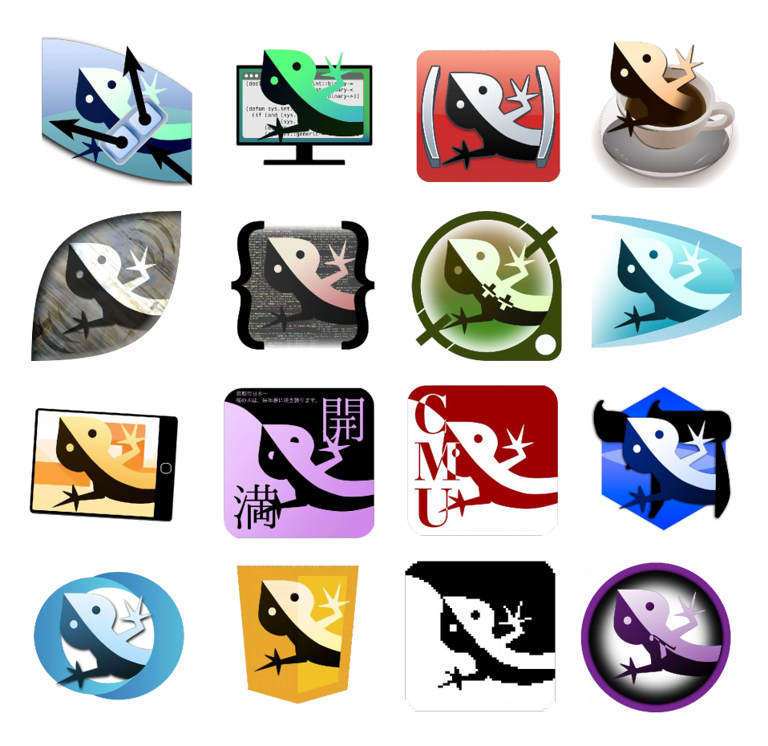

# Common Lisp: The Elusive Language

A small Common Lisp-related art project that I did back in 2017 and decided to upload here for posterity. And for viewing pleasure.

The [PDF file](the-elusive-language.pdf) contains all logos along with a bit of commentary from me. The [`png`](png/) folder contains (1000px)² versions of these images.

## Credits

* ECL: The Embeddable Common Lisp logo which I remixed is licensed under LGPL2 or later.
* ABCL: Coffee cup SVG by user Peewack on Wikipedia. Original photo by Julius Schorzman. Distributed under the CC BY-SA 2.0 license.
* CMU CL: The logo of Carnegie Mellon University, the initials of which I used in my remix, belong to the CMU.
* JSCL: The JavaScript 5 logo that I remixed is distributed under CC BY 3.0.
CCL, ACL, LW, SCL, MOCL: The orignial logos for these implementations are properties of their respective companies and I am not affiliated with them.

Everything not covered by these disclaimers is my work and is distributed under CC BY-SA 3.0.
